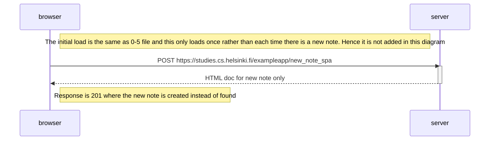

```mermaid
sequenceDiagram
  participant browser
  participant server

  Note right of browser: The initial load is the same as 0-5 file and this only loads once rather than each time there is a new note. Hence it is not added in this diagram

  browser->>server: POST https://studies.cs.helsinki.fi/exampleapp/new_note_spa
  activate server
  server-->>browser: HTML doc for new note only
	deactivate server
  Note right of browser: Response is 201 where the new note is created instead of found
```
